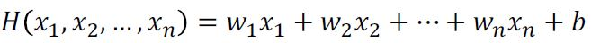
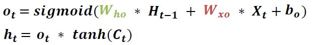

# Day1

## 1. Machine Learning이란?
  * ### Supervised Learning(지도학습)
    - 미리 레이블링 된 준비된 데이터를 가지고 학습을 하는 방법
    - Training data set : Labeled data
    - 예 : AlphaGo
  * ### Unsupervised Learning(비지도학습)
    - 일일이 레이블링 할 수 없는 데이터를 이용해 할습할 때
    - 예 : google news grouping

## 2. Supervised Learning(지도학습)
  * ### Regression(회기)
    - 연속성이 있는 범위에서의 결과를 예측하는 기계학습
    - 예 : 시험 점수 예측, 거리에 따른 배달시간 예측
  * ### Binary classification(이진분류)
    - 예측할 class가 두 가지인 경우
    - 예 : 시험 결과가 Pass일 것인가 Non-pass일 것인가
  * ### Multi-label classification
    - 예측할 class가 여러가지인 경우
    - 예 : 시험 걸과에 의한 학점이 A, B, C, D, F 중 무엇이 될 것인가

## 3. Linear Regression
  * 2차원 좌표에 분포된 데이터를 1차원 직선 방정식을 통해 표현되지 않은 데이터를 예측하기 위한 분석 모델
  * H(x) = Wx + b 형태를 띔
  * cost = (H(x) - Y)2의 값들의 평균 = 
  * 궁극적인 목표는 <b>가장 작은 cost값</b>을 갖도록 하는 <b>W</b>와 <b>b</b>를 구하는 것
  * cost함수의 그래프
     
  * W값을 찾는 방법
     
  * 더 많은 변수가 있는 경우 = 

## 4. Logistic classification
  * 0또는 1의 결과를 가지는 Binary Classification일 때 Linear Regression의 문제점
    - 큰 Input 값으로 인해 H(x)를 변형할 경우 틀린 결과 값(Y)가 도출 될 수 있음
    - H(x)를 변형하지 않고, x에 큰 값을 입력하면 1보다 큰 결과
  * <b>Sigmoid Function</b>(Logistic Function)의 등장으로 문제점 해결!
  * 어떤 값이든지 sigmoid 함수를 통과하기만 하면 0과 1 사이의 값이 됨
  * 
  * Logistic classification의 H(x)를 cost함수에 적용하면 최적의 cost를 찾을 수 없음
  * cost함수는 <b>예측 값(H(x))과 결과값(Y)이 일치할수록 0에 가까워지도록</b> log를 이용하여 수정하자
  * 

## 5. Softmax Regression
  * 여러개의 class가 있을때 그것을 예측하기 위한 multinomial classification
  * 
  * 각 레이블마다의 결과를 확률값으로 변경
     
  * 입력을 sigmoid와 마찬가지로 0과 1 사이의 값으로 변환
  * 변환된 결과에 대한 합계가 1이 되도록 만듬
  * 변형된 cost 함수
     
     

## 6. Overfitting
  * 학습데이터에만 너무 맞도록 학습이 된 경우 -> 배운 것만 알고 다른 것들은 모르는 케이스
     
      W값이 너무 커지면 구불구불한 형태의 cost 함수가 만들어짐
  * Regularization(일반화)를 이용하여 해결
     
  * Regularization은 W가 너무 큰 값들을 갖지 않도록 하는 것

# Day2

## 1. XOR Problem
  * Single Logistic Regression은 AND, OR Problem은 해결하지만 XOR Problem은 해결 못함
     
  * Multiple Logistic Regression으로 해결 가능!
     
  * 해결 예시
     
  * ### Forward Propagaion
    - 앞에서부터 뒤로 진행하면서 W와 b를 바꾸어 나갈 때
       
       
  * <b>Chain Rule</b>
     

## 2.Backward Propagaion
  * 뒤에서부터 앞으로 거꾸로 진행하면서 바꾸어 나갈 때
  * 결과에 가장 큰 영향을 주는 것은 뒤쪽 layer이다
  * 즉, 많은 layer 중에서 뒤쪽에 있는 일부만 수정을 하는 것이 훨씬 더 좋은 예측을 할 수 있음
     

## 3. ReLU(Rectified Linear Unit)
  * ### ReLU의 등장
    - backpropagation에서 결과를 전달할 때 sigmoid를 사용함
    - 그런데, sigmoid는 전달된 값을 0과 1 사이로 심하게 변형하여 값이 현저하게 작아지는 현상이 벌어짐(<b>vanishing gradient</b>)
    - ReLU 함수는 그림에 있는 것처럼 0보다 작을 때는 0을 사용하고, 0보다 큰 값에 대해서는 해당 값을 그대로 사용하는 방법
       
    - DNN에서는 sigmoid 대신 ReLU를 사용
    - 0과 현재 값(x) 중에서 큰 값을 선택 = max(0,x)

## 4. Convolutional Neural Network
  * ### CNN이란?
    - 이미지 인식을 위한 인공 신경망
     
  * ### Conv layer
    -  
    - 입력된 이미지 데이터로부터 <b>특징</b>을 추출하는 layer
    - 특징을 추출하는 <b>Filter</b> 와 추출한 필터 값을 비선형 값으로 바꾸는 <b>Activation Function(ReLU)</b> 으로 구성
    - Activation Function가 선형이면 층을 쌓은 혜택이 없음 -> 비선형으로 해야 표현력 증가
    - 픽셀의 값들을 x1~x75라고 할 때, XW+b의 방식으로 계산하여 하나의 값을 구함
       
    - W는 weight에 해당하는 값으로 여기서는 필터(filter)에 해당(W값은 불변)
    - W를 찾는 것이 deep learning의 목표라고 한다면, 올바른 필터를 찾는 것이 CNN의 목표
    - 해당하는 값을 얻기 위해 Wx+b의 결과를 ReLU에 전달
    - 일정 간격으로 필터를 옮겨가면서 해당 구역의 대표값을 계속해서 구함
    - 원본 이미지의 크기가 줄어들지 않도록 <b>padding</b>을 넣어줌
       
  * ### Pooling layer
    - pooling의 다른 말은 sampling 또는 resizing
    - 입력 이미지 사이즈가 줄어 연산량 감소, 오버피팅 방지
    - 어떤 작업을 하건 pooling을 거치면 크기가 작아진다는 것이 핵심
       
    - <b>MAX POOLING</b>은 여러 개의 값 중에서 가장 큰 값을 꺼내서 모아 놓는 것을 뜻함
       
  * ### FC(Fully-connected Layer)
    - 최종 추출된 특징 값을 일반적인 NN에 넣어 분류
    - 보통 dropout을 같이 사용
    - Activation Function으로 Softmax를 일반적으로 사용(확률 값을 가져오기 위해)
       
  * CNN 최종 과정
    -  
  * ### AlexNet
    - 최초로 ReLU를 사용
    - Normalization Layer를 사용(현재는 잘 쓰지 않음)
    - Dropout을 사용

# Day3

## 1. RNN
  * ### Sequence Data
    - 시간성을 갖는 데이터
    - 데이터 집합 내의 객체들이 어떤 순서를 가지고 있으며, 순서가 변경되면 고유의 성질을 잃어버림
    - 언어(음성인식, 자연어), 센서데이터, 주가변동 등 time-series data 모두 sequence Data
    - NN/CNN으로 처리가 힘듬
  * ### RNN이란?
    - Sequence Data를 처리하는데 최적화된 인공 신경망
    - Hidden Node(RNN Cell)가 Directed Cycle을 형성하는 인공 신경망의 한 종류
    - t-1시점의 상태를 t시점에서 고려 가능
    - 다양하고 유연하게 네트워크 구성 가능4
       
    - Multi-Layer RNN은 hidden layer를 여러 층올 구성하여 더 복잡한 학습이 가능
       
    - RNN 개념도
       
    - RNN의 핵심은 <b>상태</b>와 <b>예측</b>에 있음
    - <b>상태</b>를 가리키는 값은 <b>hidden layer</b>에 있고 매번 바뀜
    - <b>예측</b>을 가리키는 값은 <b>output layer</b>에 있고 매번 예측
  * ### RNN 구조
    - 
    - RNN에서 가장 중요한 것은 상태(state)를 갖는다는 것이고, ht라고 표현
    - 매번 들어오는 입력은 Xt라고 표현
    - 모든 step에서 사용하는 weight와 F(tanh)가 동일하게 적용 -> 순환구조로 표현가능
       
  * ### (Vanilla)RNN
    - 
    - t는 sequence data에 대한 특정 시점의 데이터를 가리킴
    - 첫 번째 줄의 공식은 W의 이전 상태와 입력을 갖고 fw에 해당하는 tanh 함수를 호출하는 것
    - <b>ht</b>는 <b>현재 상태</b>를 의미하고 h의 t-1번째는 이전(old) 상태와 입력 값(x)을 사용해서 계산
    - <b>yt</b>는 <b>예측 값</b>을 의미하고, W와 현재 상태(ht)를 곱해서 계산
  * ### Character Modeling
    - 글자를 다루는 RNN을 문자 기반의 언어 모델
    - N to N 네트워크 구성 사용
    - HELLO를 완성 시키기 위해 'H','E','L','L'을 순차적으로 입력
    - One-hot Encoding을 이용하여 각 문자를 Vector로 표현
       
    - Character Modeling 도식
       
  * ### Sentiment Classification
    - 글의 감성을 분류하는 것(긍정 또는 부정)
    - N to 1 네트워크 구성 사용
    - Word Embedding(Ex.Word2Vec)을 이용하여 각 단어를 Vector로 표현
       
    - Sentiment Classification 도식화
       
## 2. LSTM(Long Short-Term Memory)
  * ### RNN의 문제점
    - Long-Term Dependencies(장기의존성) 문제
    - Hidden Node(RNN Cell)가 많은 경우 Vanishing Gradient
    - 
  * ### LSTM이란?
    - <b>장기의존성 문제</b>를 <b>해결한 RNN</b>의 일종
    - <b>RNN Hidden State</b>에 <b>Cell State(Using 3-Gate)</b>를 추가한 것
    - Gate에는 <b>Forget Gate, Input Gate, Output Gate</b>가 있음
    - RNN과 LSTM의 구조
       
  * ### Cell State(Ct)
    - Cell State에 Gate라는 요소를 활용하여 정보를 더하거나 제거
    - Cell State를 컨트롤하기 위한 3가지 Gate로 구성
    - Forget Gate, Input Gate, Output Gate
    - 일종의 컨베이어 벨트로 생각
       
  * ### Forget Gate(ft)
    - <b>Cell State</b>에서 과거 정보를 잊기 위한 Gate
       
    - ht-1과 xt를 입력받고, sigmoid를 취해 0~1 사이의 출력 값을 냄
    - 0이면 '이전 상태의 정보를 잊어라'라는 의미
    - 1이면 '이전 상태의 정보를 온전히 기억하라'라는 의미
       
  * ### Input Gate(it)
    - <b>Cell State</b>에 현재 정보를 기억하기 위한 Gate
       
    - <b>ht-1</b>과 <b>xt</b>를 입력 받고 sigmoid나 tanh를 취해 출력 값을 냄
    - it : <b>sigmoid</b>를 취해  ~1 사이의 출력 값을 냄(어떤 값을 업데이트할 지 정함)
    - Ct : <b>tanh</b>를 취해 -1~1 사이의 출력 값을 냄(새로운 후보 vector 생성)
       
  * Cell State Update
    - Forget Gate와 Input Gate를 사용하여 Cell State를 업데이트
       
       
  * Output Gate(ot)
    - <b>Hidden State</b>를 출력하기 위한 Gate
       
       
