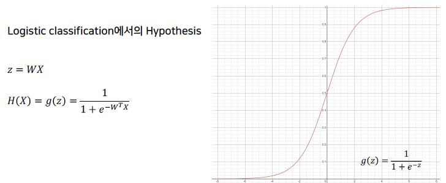
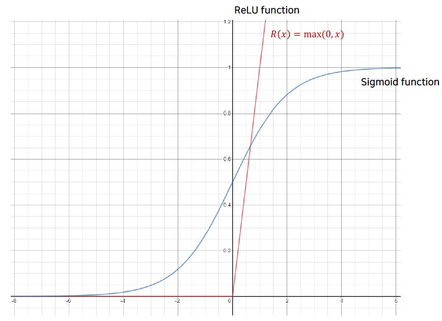

# Day1

## 1. Machine Learning이란?
  * ### Supervised Learning(지도학습)
    - 미리 레이블링 된 준비된 데이터를 가지고 학습을 하는 방법
    - Training data set : Labeled data
    - 예 : AlphaGo
  * ### Unsupervised Learning(비지도학습)
    - 일일이 레이블링 할 수 없는 데이터를 이용해 할습할 때
    - 예 : google news grouping

## 2. Supervised Learning(지도학습)
  * ### Regression(회기)
    - 연속성이 있는 범위에서의 결과를 예측하는 기계학습
    - 예 : 시험 점수 예측, 거리에 따른 배달시간 예측
  * ### Binary classification(이진분류)
    - 예측할 class가 두 가지인 경우
    - 예 : 시험 결과가 Pass일 것인가 Non-pass일 것인가
  * ### Multi-label classification
    - 예측할 class가 여러가지인 경우
    - 예 : 시험 걸과에 의한 학점이 A, B, C, D, F 중 무엇이 될 것인가

## 3. Linear Regression
  * 2차원 좌표에 분포된 데이터를 1차원 직선 방정식을 통해 표현되지 않은 데이터를 예측하기 위한 분석 모델
  * H(x) = Wx + b 형태를 띔
  * cost = (H(x) - Y)2의 값들의 평균 = 
  * 궁극적인 목표는 가장 작은 cost값을 갖도록 하는 W와 b를 구하는 것
  * cost함수의 그래프
     
  * W값을 찾는 방법
     
  * 더 많은 변수가 있는 경우 = 

## 4. Logistic classification
  * 0또는 1의 결과를 가지는 Binary Classification일 때 Linear Regression의 문제점
    - 큰 Input 값으로 인해 H(x)를 변형할 경우 틀린 결과 값(Y)가 도출 될 수 있음
    - H(x)를 변형하지 않고, x에 큰 값을 입력하면 1보다 큰 결과
  * _Sigmoid Function_(Logistic Function)의 등장으로 문제점 해결!
  * 어떤 값이든지 sigmoid 함수를 통과하기만 하면 0과 1 사이의 값이 됨
  * 
  * Logistic classification의 H(x)를 cost함수에 적용하면 최적의 cost를 찾을 수 없음
  * cost함수는 예측 값(H(x))과 결과값(Y)이 일치할수록 0에 가까워지도록 log를 이용하여 수정하자
  * 

## 5. Softmax Regression
  * 여러개의 class가 있을때 그것을 예측하기 위한 multinomial classification
  * 
  * 각 레이블마다의 결과를 확률값으로 변경
     
  * 입력을 sigmoid와 마찬가지로 0과 1 사이의 값으로 변환
  * 변환된 결과에 대한 합계가 1이 되도록 만듬
  * 변형된 cost 함수
     
     

## 6. Overfitting
  * 학습데이터에만 너무 맞도록 학습이 된 경우 -> 배운 것만 알고 다른 것들은 모르는 케이스
     
      W값이 너무 커지면 구불구불한 형태의 cost 함수가 만들어짐
  * Regularization(일반화)를 이용하여 해결
     
  * Regularization은 W가 너무 큰 값들을 갖지 않도록 하는 것

# Day2

## 1. XOR Problem
  * Single Logistic Regression은 AND, OR Problem은 해결하지만 XOR Problem은 해결 못함
     
  * Multiple Logistic Regression으로 해결 가능!
     
  * 해결 예시
     
  * ### Forward Propagaion
    - 앞에서부터 뒤로 진행하면서 W와 b를 바꾸어 나갈 때
    -  
       
  * _Chain Rule_
     

## 2.Backward Propagaion
  * 뒤에서부터 앞으로 거꾸로 진행하면서 바꾸어 나갈 때
  * 결과에 가장 큰 영향을 주는 것은 뒤쪽 layer이다
  * 즉, 많은 layer 중에서 뒤쪽에 있는 일부만 수정을 하는 것이 훨씬 더 좋은 예측을 할 수 있음
     

## 3. ReLU(Rectified Linear Unit)
  * ### ReLU의 등장
    - backpropagation에서 결과를 전달할 때 sigmoid를 사용함
    - 그런데, sigmoid는 전달된 값을 0과 1 사이로 심하게 변형하여 값이 현저하게 작아지는 현상이 벌어짐(_vanishing gradient_)
    - ReLU 함수는 그림에 있는 것처럼 0보다 작을 때는 0을 사용하고, 0보다 큰 값에 대해서는 해당 값을 그대로 사용하는 방법
       
    - DNN에서는 sigmoid 대신 ReLU를 사용
    - 0과 현재 값(x) 중에서 큰 값을 선택 = max(0,x)

## 4. Convolutional Neural Network
  * ### CNN이란?
    - 이미지 인식을 위한 인공 신경망
     
  * ### Conv layer
    -  
    - 픽셀의 값들을 x1~x75라고 할 때, XW+b의 방식으로 계산하여 하나의 값을 구함
       
    - W는 weight에 해당하는 값으로 여기서는 필터(filter)에 해당(W값은 불변)
    - W를 찾는 것이 deep learning의 목표라고 한다면, 올바른 필터를 찾는 것이 CNN의 목표
    - 해당하는 값을 얻기 위해 Wx+b의 결과를 ReLU에 전달
    - 일정 간격으로 필터를 옮겨가면서 해당 구역의 대표값을 계속해서 구함
    - 원본 이미지의 크기가 줄어들지 않도록 padding을 넣어줌
       
  * ### Pooling layer
    - pooling의 다른 말은 sampling 또는 resizing
    - 어떤 작업을 하건 pooling을 거치면 크기가 작아진다는 것이 핵심
       
    - _MAX POOLING_ 은 여러 개의 값 중에서 가장 큰 값을 꺼내서 모아 놓는 것을 뜻함
       
  * ### AlexNet
    - 최초로 ReLU를 사용
    - Normalization Layer를 사용(현재는 잘 쓰지 않음)
    - Dropout을 사용
